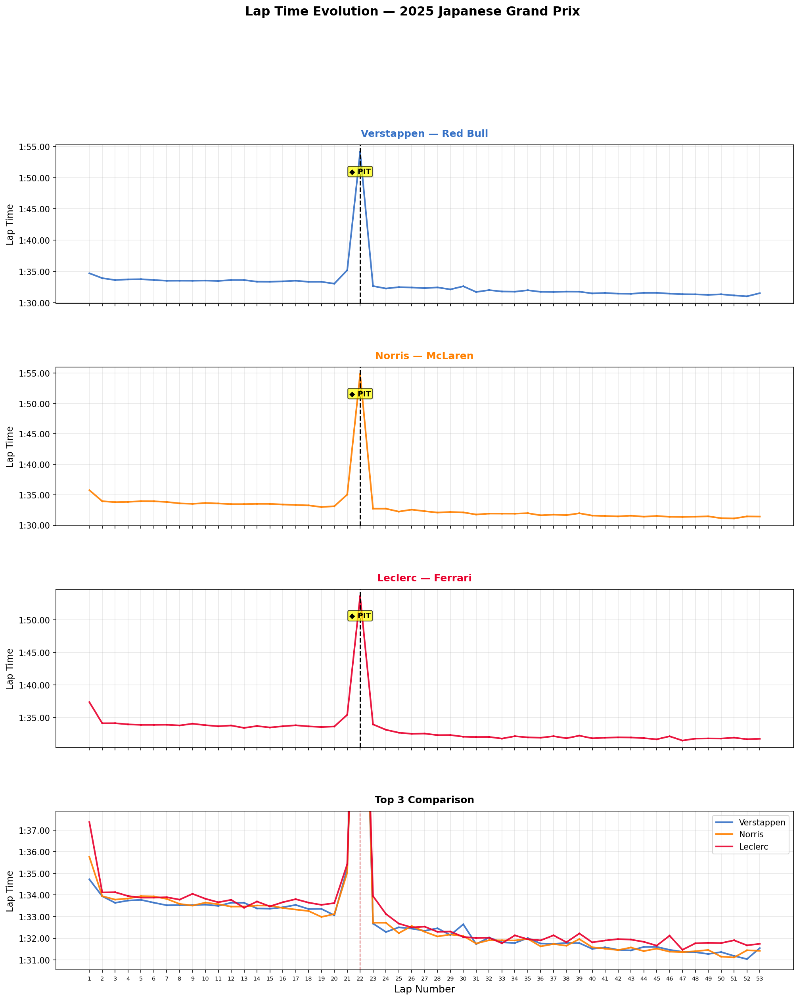
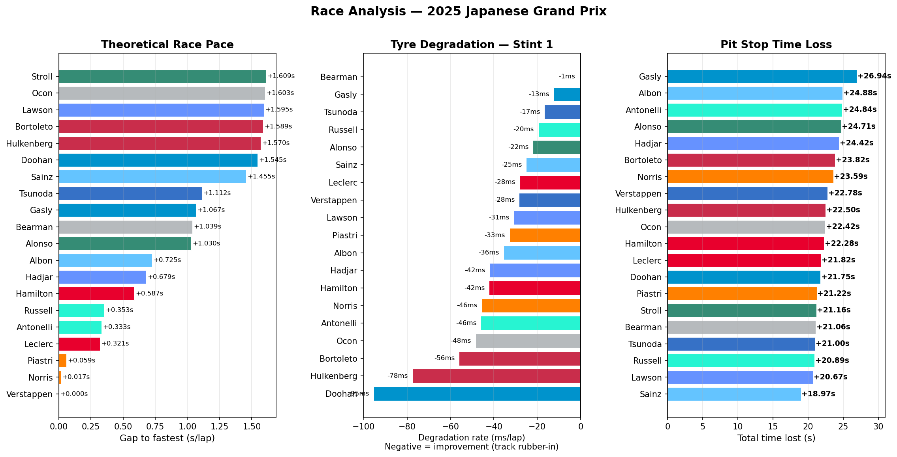

# F1 & WEC Data Analysis

Motorsport telemetry and strategy analysis using real official timing data.  
Personal project developed alongside engineering studies at INSA Lyon.

## 🏎️ 2025 Japanese Grand Prix — Full Race Analysis

**Data source:** FastF1 (official F1 timing data)  
**Circuit:** Suzuka — 53 laps  
**Drivers analysed:** All 20 drivers across all 10 teams

### Lap Time Evolution
Lap-by-lap time visualisation for Verstappen, Norris and Leclerc.  
Pit stop markers highlight inlap and outlap. Grey zones indicate laps where FastF1 data is unavailable.  
A comparison plot overlays the top 3 drivers on a zoomed axis to reveal inter-driver gaps.

### Race Analysis

**Theoretical Race Pace**  
Average lap time per driver excluding pit stop laps (inlap and outlap).  
Gives a clean comparison of raw pace independent of strategy.

**Tyre Degradation — Stint 1**  
Linear regression slope of lap times across Stint 1, in ms/lap.  
A negative value means the driver is improving — typical of Suzuka where the track rubbers-in significantly.  
Drivers closer to 0 managed their tyres more conservatively in the opening stint.

**Pit Stop Time Loss**  
Total time lost during the pit stop, calculated as:  
`(inlap + outlap) − 2 × average of the 3 reference laps before the pit`  
Isolates the pure cost of stopping, independent of tyre performance gain.

### Key Findings
- **Verstappen** had the best theoretical race pace and the most consistent Stint 1 (±0.325s std deviation)
- **Norris** matched Verstappen on pure pace (+0.017s/lap) — McLaren was equally strong over the full distance
- **Leclerc** was 0.321s/lap slower, translating to a ~17s deficit over the race distance
- Tyre degradation was negative for all drivers — Suzuka's track rubber-in effect dominates over rubber wear
- **Sainz** lost the least time at his pit stop (+18.97s), **Gasly** the most (+26.94s)

## Tools & Libraries
- Python, Jupyter Notebook
- FastF1 (official F1 timing data)
- Pandas, Matplotlib, NumPy

## Roadmap
- [x] Lap time visualisation — 2025 Japanese Grand Prix
- [x] Theoretical race pace comparison (all 20 drivers)
- [x] Tyre degradation analysis per stint
- [x] Pit stop time loss quantification
- [ ] Delta time analysis between drivers
- [ ] WEC 6h Imola 2026 live analysis
- [ ] LMH tyre strategy comparison
- [ ] Pit stop window optimisation model
