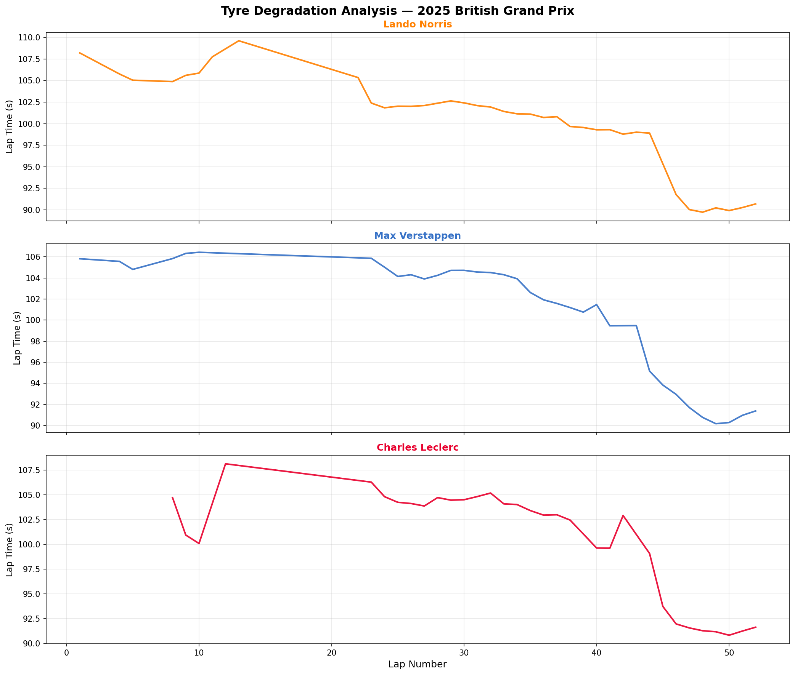

# F1 & WEC Data Analysis

Motorsport telemetry and strategy analysis using real timing data.
Personal project developed alongside engineering studies at INSA Lyon.

## Current analyses

### 🏎️ 2025 British Grand Prix — Tyre Degradation
Lap time evolution and stint analysis for Verstappen, Norris and Leclerc.
Pit stops identified and highlighted. Tyre degradation quantified per stint.

## Tools & Libraries
- Python, Jupyter Notebook
- FastF1 (official F1 timing data)
- Pandas, Matplotlib

## Roadmap
- [ ] WEC 6h Imola 2026 live analysis
- [ ] LMH tyre strategy comparison
- [ ] Pit stop window optimization model
