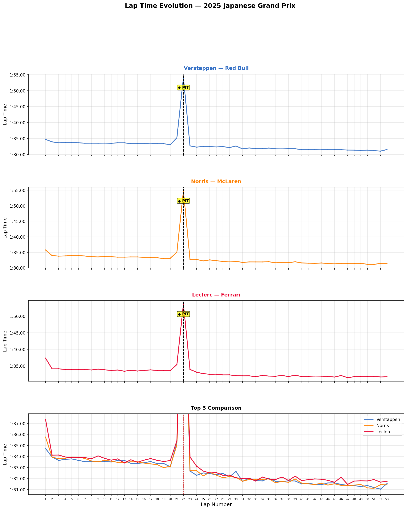
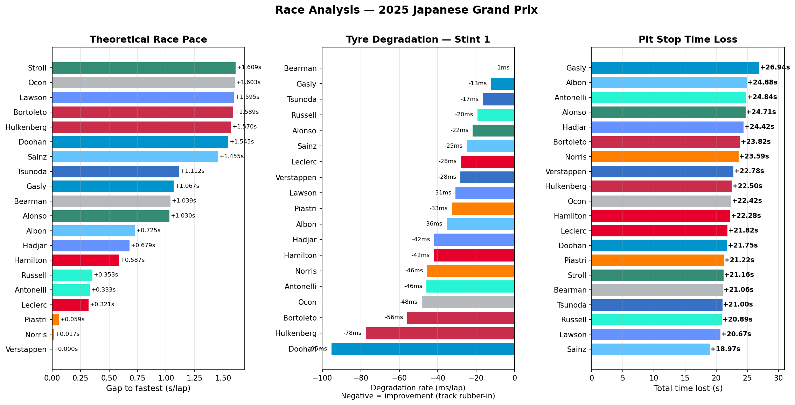
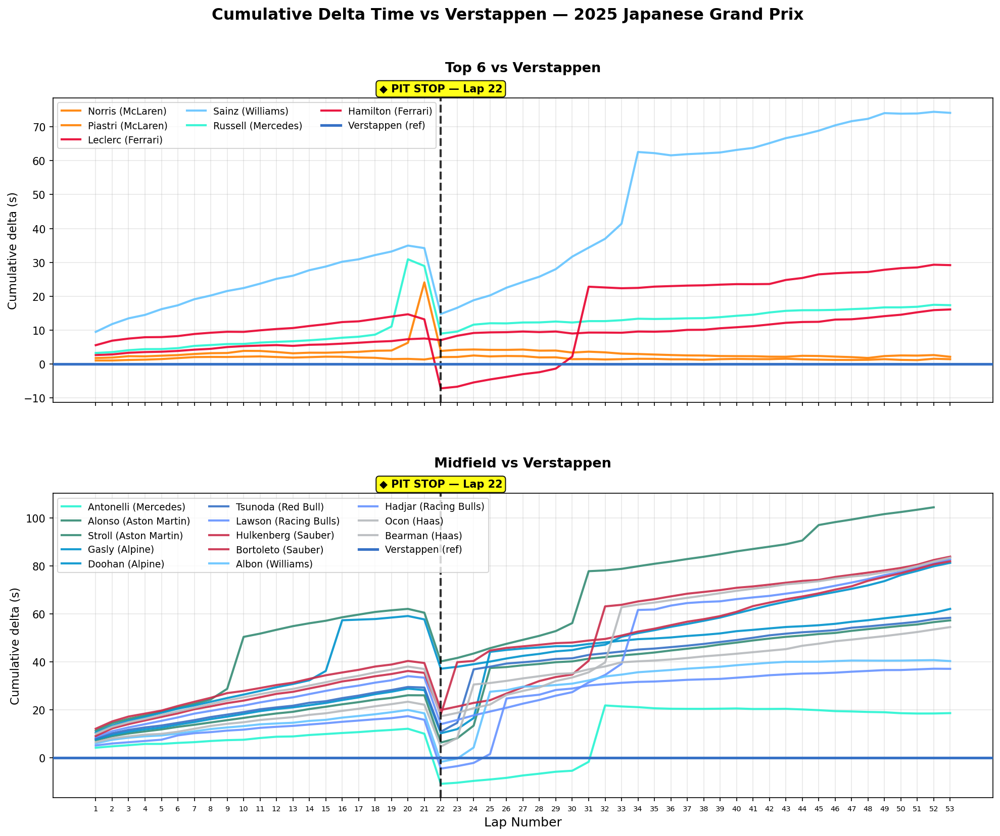

# F1 Race Data Analysis

*Personal project developed alongside engineering studies at INSA Lyon, 
as part of a motorsport-oriented approach.*

---

## Motivation

Breaking into motorsport engineering requires more than academic knowledge — 
it requires understanding how real race data is structured, what questions 
engineers actually ask, and how to extract meaningful insights from imperfect 
information.

This project is my attempt to do exactly that, using publicly available timing 
data to replicate — at a basic level — the kind of analysis a race strategy 
engineer performs during and after a Grand Prix.

---

## Data Source & Limitations

All data comes from **FastF1**, an open-source Python library that interfaces 
with the official F1 timing API. While FastF1 provides genuine race telemetry, 
it has significant limitations that shaped every methodological choice in this project:

- **Incomplete lap data**: many races in the 2025 season have missing lap times 
for one or more drivers, with no clear pattern or explanation
- **No car data for some rounds**: telemetry channels (speed, throttle, brake) 
are missing for entire driver entries in several races

**Before any analysis, every race was systematically screened** for data 
completeness across all 20 drivers. Only races passing this check were used.

```python
# Completeness check — run across all 2025 races
for race in races:
    for driver in ['VER', 'NOR', 'LEC']:
        available = len(data.dropna(subset=['LapTime']))
        total = int(laps['LapNumber'].max())
        print(f"{race} | {driver}: {available}/{total} laps")
```

From this screening, the **2025 Japanese Grand Prix (Suzuka)** was selected 
as the primary dataset — 53/53 laps available for all 20 drivers.

---

## Methodological Choices

**Why lap time as the primary metric?**  
Lap time is the most direct measure of car+driver+tyre performance available 
in public data. It integrates everything — fuel load, tyre condition, traffic, 
driver management — into a single number that evolves over the race distance.

**Why exclude pit stop laps from pace calculations?**  
Inlap and outlap times are not representative of steady-state performance. 
Including them would artificially inflate degradation rates and distort pace 
comparisons. They are shown on the charts for completeness but excluded from 
all numerical calculations.

**Why use linear regression for degradation?**  
Tyre degradation is not perfectly linear, but over a single stint with no 
major incidents, a linear approximation is a reasonable first-order model. 
The slope (ms/lap) gives a simple, comparable metric across drivers and stints.

**Why Cumulative Delta Time?**  
Raw lap times are hard to compare across drivers because small differences 
accumulate. Plotting the cumulative gap relative to a reference driver 
(Verstappen) makes it immediately clear who is gaining or losing time, 
and at what point in the race.

---

## Analysis — 2025 Japanese Grand Prix

**Circuit:** Suzuka — 53 laps  
**Data quality:** 100% lap coverage for all 20 drivers  

### Lap Time Evolution
Lap-by-lap visualisation for Verstappen, Norris and Leclerc.
Pit stop markers indicate the inlap. Grey zones = missing data.



### Race Analysis
Three metrics computed for all 20 drivers:

**Theoretical Race Pace** — average lap time excluding pit stop laps.  
Gives a strategy-independent measure of raw performance.

**Tyre Degradation (Stint 1)** — linear regression slope in ms/lap.  
A negative value means improvement: at Suzuka, track rubber-in dominates 
over tyre wear, so all drivers improve through their stints. Drivers 
closest to 0 managed their tyres most conservatively.

**Pit Stop Time Loss** — calculated as:  
`(inlap + outlap) − 2 × average of 3 reference laps before the stop`  
Isolates the pure cost of stopping from the performance gain of fresh tyres.



### Key Findings
- Verstappen had the best theoretical pace and the most consistent Stint 1 (±0.325s std deviation vs ±0.560s for Norris)
- Norris matched Verstappen over the full race distance (+0.017s/lap) — McLaren was equally fast
- Leclerc was 0.321s/lap slower, a ~17s deficit over 53 laps — a significant structural gap
- Degradation was negative for all drivers — Suzuka's rubber-in effect outweighs tyre wear
- Sainz lost the least time at his pit stop (+18.97s), Gasly the most (+26.94s)

### Cumulative Delta Time
Gap relative to Verstappen, accumulated lap by lap. A rising curve = losing time. 
Flat = matched pace. The pit stop window is clearly visible for all drivers.



---

## Roadmap

- [x] Data completeness screening across 2025 season
- [x] Lap time visualisation with missing data handling
- [x] Theoretical race pace — all 20 drivers
- [x] Tyre degradation analysis per stint
- [x] Pit stop time loss quantification
- [x] Cumulative delta time analysis
- [ ] Multi-race comparison — pace evolution across 2025 season
- [ ] Pit stop window optimisation model
- [ ] Expansion to endurance racing data when a reliable source is identified

---

## Tools
Python, Jupyter Notebook, FastF1, Pandas, Matplotlib, NumPy
